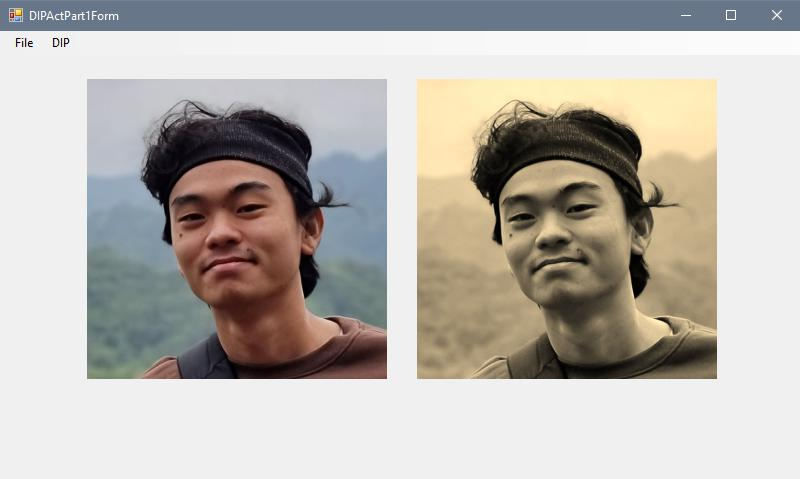
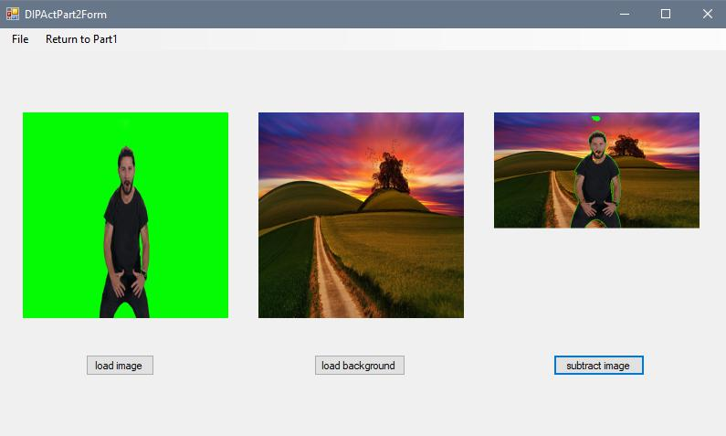

# CS345 Image Processing Activity Part 1 & 2
### Part 1 and 2 of the activity are two different forms inside one solution.
* Only `Subtract` process will open a new form dedicated for subtracting images.

* Click on `Return to Part1` on the new form to return back to the part 1 of the activity

